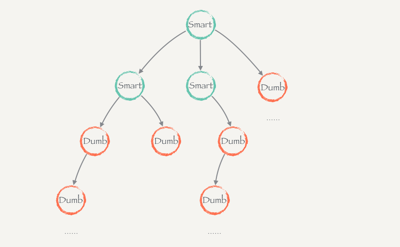

# Flutter State Management  

## 1. State & Props （状态 & 属性）  
什么是 Props？  
`Props` 是由 `父组件` 传递给 `子组件` 的 **变量或者数据（甚至是函数，方法）**，它在子组件构造函数执行初始化时被初始化，初始化后 `不能被修改`。

什么是 State？  
`State` 是由组件 **自身管理的变量或者数据**， 当 State 变化时（`通过 setState()`）， UI 的构建器将会自动的重新渲染对应的 `UI树`。组件自身的State是可变的，而且可以作为变量或者数据传递给子组件。

Flutter 根据这两种概念 提供了两种 Widget：  
- StatelessWidget
> 不含有状态（`State`）的组件（`无生命周期`），内部变量在组件被创建时就已经固定，或者由父级传入变量在构造器函数运行时初始化。
- StatefulWidget
> 含有状态的组件， 组件拥有自己的状态（`State`）, 可以通过 `生命周期` 或者 函数（`setState()`） 来更新自身的状态变量， 从而更新 `UI树`。

下面的两段代码分别是 `有状态组件` 和 `无状态组件` 的实现：  
```dart
/// 无状态组件

class WithoutStateWidget extends StatelessWidget {

  final int count;

  WithoutStateWidget(this.count);

  @override
  Widget build(BuildContext context) {
    return Container(
      width: double.infinity,
      height: 200,
      padding: EdgeInsets.only(top: 30.0),
      decoration: BoxDecoration(
        border: Border.all(width: 1, color: Colors.black26),
      ),
      child: Column(
        children: <Widget>[
          Text(
            'Widget Without State',
            style: TextStyle(
              fontSize: 24.0
            ),
          ),
          Expanded(
            child: Center(
              child:  Text(
                'count: $count',
                style: TextStyle(
                  fontSize: 24.0
                )
              ),
            ),
          )
        ],
      ),
    );
  }

}
```

```dart
/// 有状态组件
class WithStateWidget extends StatefulWidget {

  final getCount;

  WithStateWidget({ this.getCount });

  @override
  _WithStateWidgetState createState() => _WithStateWidgetState();

}

class _WithStateWidgetState extends State<WithStateWidget> {

  int count = 0;

  @override
  Widget build(BuildContext context) {
    print(context);
    return Container(
      width: double.infinity,
      height: 200,
      padding: EdgeInsets.only(top: 30.0),
      child: Column(
        children: <Widget>[
          Text(
            'Widget With State',
            style: TextStyle(
              fontSize: 24.0
            )
          ),
          Expanded(
            child: Row(
              mainAxisAlignment: MainAxisAlignment.spaceEvenly,
              children: <Widget>[
                _buildButton(
                  buttonColor: Colors.blue,
                  fontColor: Colors.white,
                  icon: Icons.add,
                  onPressed: () {
                    setState(() {
                      count++;
                      if (widget.getCount != null) {
                        widget.getCount(count);
                      }
                    });
                  } 
                ),
                _buildButton(
                  buttonColor: Colors.blue,
                  fontColor: Colors.white,
                  icon: Icons.remove,
                  onPressed: () {
                    setState(() {
                      count--;
                      if (widget.getCount != null) {
                        widget.getCount(count);
                      }
                    });
                  } 
                ),
                Text(
                  'count: $count',
                  style: TextStyle(
                    fontSize: 24.0
                  )
                )
              ],
            ),
          ),
        ],
      ),
      decoration: BoxDecoration(
        border: Border.all(width: 1, color: Colors.black26),
      ),
    );
  }

  Widget _buildButton({ Color buttonColor, Color fontColor, icon, onPressed }) {
    return Ink(
      child: IconButton(
        icon: Icon(icon),
        onPressed: onPressed,
        color: fontColor,
      ),
      decoration: ShapeDecoration(
        color: Colors.lightBlue,
        shape: CircleBorder(),
      ),
    );
  }

}

```

相对比而言，有状态组件的实现相对麻烦。
1. 首先，要实现一个 `有状态组件的类`， 然后在这个类中进行组件的初始化工作（如构造函数的初始化）。
2. 其次，要在组件内部通过 `createState()` 实例化该组件的状态类。  
3. 实现一个该组件的 `状态类`，包括渲染 `UI树` 的方法。
4. `state` 通过 `widget.xxxx` 的方式调用组件类中的属性和方法。

---

## 2. Downward Data Flow （单向数据流）  
单向数据流指的是数据在 Flutter App 中的流动方向， 它总是从上到下流动的，即数据总是通过 父组件 流动到 子组件， 如果想要数据的反向流动， 一般方式是做不到的，需要通过特殊的方法（比如通过传递回调函数的方式）。  
下面是一个单向数据流的小 Demo：  
```dart
/// router pass a text to demo page
Map<String, WidgetBuilder> router(context) {
  return {
    // ...other code
    '/origin/2': (context) => DownwardDataPage(
      text: ModalRoute.of(context).settings.arguments
    ),
    // ...other code
  };
}

/// page get the text and initialized,
/// and let the text down to their sub widget
class DownwardDataPage extends StatelessWidget {

  final String text;

  DownwardDataPage({ @required this.text });

  @override
  Widget build(BuildContext context) {
    return Scaffold(
      appBar: AppBar(
        title: Text('Downward Data Flow'),
        centerTitle: true,
      ),
      body: _buildPageContainer(text + '1')
    );
  }

  Widget _buildPageContainer(String displayText) {
    return Container(
      padding: EdgeInsets.all(20.0),
      child: Column(
        children: <Widget>[
          Text(
            'Page: $displayText',
            style: TextStyle(
              fontSize: 16.0
            )
          ),
          _buildOuterContainer(displayText + '2')
        ],
      )
    );
  }

  Widget _buildOuterContainer(String displayText) {
    return Container(
      width: double.infinity,
      padding: EdgeInsets.all(20.0),
      margin: EdgeInsets.only(top: 20.0),
      child: Column(
        children: <Widget>[
          Text(
            'Outer: $displayText',
            style: TextStyle(
              fontSize: 16.0
            )
          ),
          _buildInnerContainer(displayText + '3')
        ],
      ),
      decoration: BoxDecoration(
        border: Border.all(
          width: 1.0,
          color: Colors.black26
        )
      ),
    );
  }

  Widget _buildInnerContainer(String displayText) {
    return Container(
      width: double.infinity,
      padding: EdgeInsets.all(20.0),
      margin: EdgeInsets.only(top: 20.0),
      child: Column(
        children: <Widget>[
          Text(
            'Inner: $displayText',
            style: TextStyle(
              fontSize: 16.0
            )
          ),
        ],
      ),
      decoration: BoxDecoration(
        border: Border.all(
          width: 1.0,
          color: Colors.black26
        )
      ),
    );
  }
}
```

可以看到 父组件 通过 子组件 的构造函数将数据传递给子组件，也就是 `props`，然后子组件通过 `props` 渲染 UI。  

---

## 3. State Improvement （状态提升）  

状态提升指， 如果 `相邻或者同级别的组件` 之间需要 `共享状态`，鉴于单向数据流动的原因，只能将共享的状态或者数据交给此相邻组件的 `共同的父组件` 保管。  
例如下图：  
  
其中 list2 假如也需要用到 comments 这个状态（数据），为了使comments 共享， 改成如下的形式：

将 `comments` 的状态提升至 list1和list2 共同的父组件 `commentsApp` 中， 然后将其作为 `props` 传递至 两个 list中。comments 作为 commentsApp 的 `state`， 当 comments 更新时，渲染在 app 中的 两个 list 组件会因为 app 的更新而更新（props 也会更新）。  

下面是 Demo：
```dart 
/// the super widget with two sub widget
/// one is stateful and another is stateless
/// create a function that can change super widget's state
class StateImprovementPage extends StatefulWidget {

  @override
  _StateImprovementPageState createState() => _StateImprovementPageState();

}

class _StateImprovementPageState extends State<StateImprovementPage> {

  int count = 0;

  @override
  Widget build(BuildContext context) {
    return Scaffold(
      appBar: AppBar(
        title: Text('State Improvement'),
        centerTitle: true,
      ),
      body: _buildBody()
    );
  }

  Widget _buildBody() {
    return Container(
      padding: EdgeInsets.all(20.0),
      child: Column(
        mainAxisSize: MainAxisSize.max,
        mainAxisAlignment: MainAxisAlignment.spaceEvenly,
        children: <Widget>[
          Text(
            'SuperCount: $count',
            style: TextStyle(
              fontSize: 16.0
            ),
          ),
          WithStateWidget(getCount: getCount),
          WithoutStateWidget(count)
        ],
      ),
    );
  }

  void getCount(int count) {
    setState(() {
      this.count = count;
    });
  }

}

/// the widget without state
/// initialized use the props which the super widget passed in
class WithoutStateWidget extends StatelessWidget {

  final int count;

  WithoutStateWidget(this.count);

  @override
  Widget build(BuildContext context) {
    print(context);
    return Container(
      width: double.infinity,
      height: 200,
      padding: EdgeInsets.only(top: 30.0),
      decoration: BoxDecoration(
        border: Border.all(width: 1, color: Colors.black26),
      ),
      child: Column(
        children: <Widget>[
          Text(
            'Widget Without State',
            style: TextStyle(
              fontSize: 24.0
            ),
          ),
          Expanded(
            child: Center(
              child:  Text(
                'count: $count',
                style: TextStyle(
                  fontSize: 24.0
                )
              ),
            ),
          )
        ],
      ),
    );
  }

} 

/// widget with state
/// a function which passed by super widget
/// to change the state of super widget
class WithStateWidget extends StatefulWidget {

  final getCount;

  WithStateWidget({ this.getCount });

  @override
  _WithStateWidgetState createState() => _WithStateWidgetState();

}

class _WithStateWidgetState extends State<WithStateWidget> {

  int count = 0;

  @override
  Widget build(BuildContext context) {
    print(context);
    return Container(
      width: double.infinity,
      height: 200,
      padding: EdgeInsets.only(top: 30.0),
      child: Column(
        children: <Widget>[
          Text(
            'Widget With State',
            style: TextStyle(
              fontSize: 24.0
            )
          ),
          Expanded(
            child: Row(
              mainAxisAlignment: MainAxisAlignment.spaceEvenly,
              children: <Widget>[
                _buildButton(
                  buttonColor: Colors.blue,
                  fontColor: Colors.white,
                  icon: Icons.add,
                  onPressed: () {
                    setState(() {
                      count++;
                      if (widget.getCount != null) {
                        widget.getCount(count);
                      }
                    });
                  } 
                ),
                _buildButton(
                  buttonColor: Colors.blue,
                  fontColor: Colors.white,
                  icon: Icons.remove,
                  onPressed: () {
                    setState(() {
                      count--;
                      if (widget.getCount != null) {
                        widget.getCount(count);
                      }
                    });
                  } 
                ),
                Text(
                  'count: $count',
                  style: TextStyle(
                    fontSize: 24.0
                  )
                )
              ],
            ),
          ),
        ],
      ),
      decoration: BoxDecoration(
        border: Border.all(width: 1, color: Colors.black26),
      ),
    );
  }

  Widget _buildButton({ Color buttonColor, Color fontColor, icon, onPressed }) {
    return Ink(
      child: IconButton(
        icon: Icon(icon),
        onPressed: onPressed,
        color: fontColor,
      ),
      decoration: ShapeDecoration(
        color: Colors.lightBlue,
        shape: CircleBorder(),
      ),
    );
  }

}
```

之前说过，在单向数据流中需要以特殊的方式使数据返回。  
在此例中，父组件 `StateImprovementPage` 实现了一个 `getCount()` 方法， 用来修改父组件自身的状态（`State`），然后将它作为一个属性（`props`）传递给了子组件 `WithStateWidget`，每当点击加减按钮时，会执行父组件的该方法，从而更新父组件的状态，达成 `数据反流` 的目的。 

---

## 4. Smart | Dumb? （聪明组件 or 笨组件？）  
- Dumb 组件： 只负责渲染，或执行父组件传递的函数或者方法的组件，可以拥有自己的状态，但是它的状态不会向下传递或者参与逻辑。  
比如， 一个显示文字的组件，文字是父组件通过props传递的，而它自身也有一个状态，用来修改自己的背景颜色，但是这个颜色又不影响整个app 的逻辑。  

- Smart 组件： 不仅仅负责渲染，还会参于逻辑的运算。自身状态会作为数据的一部分， 可能会向下传递。因为复杂度高，所以性能比 Dumb 组件要低。  

关于 Smart 和 Dumb 组件的划分，完全取决于具体的业务，还有应用自身的复杂度。不能说全是 Dumb 组件就是最好的，也不能都是 Smart组件。  
Dumb 组件的存在意义主要是为了复用，因为没有强绑定业务的逻辑和数据。  
一个 Dumb 组件最好不要引用 Smart 组件，因为一旦引用就会导致无法复用，所以尽可能不要做这种事。  

  
---